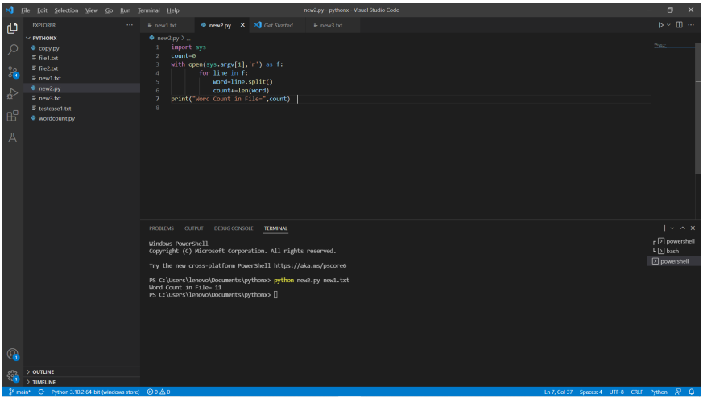

# command-line-arguments-to-count-word
## AIM:
To write a python program for getting the word count from the contents of a file using command line arguments.
## EQUIPEMENT'S REQUIRED: 
PC
Anaconda - Python 3.7
## ALGORITHM: 
### Step 1:
import sys

### Step 2: 
Initially make count = 0

### Step 3: 
Open the content file using command line arguments.

### Step 4:  
by using for loop name the function as "line"

### Step 5: 
split the line using .split

### Step 6: 
End the program.

## PROGRAM:
```
command-line-arguments-to-count-word
developed by: dhivyapriya. r
register no.: 22008389
```
import sys

count=0

with open(sys.argv[1],'r') as f:

        for line in f:

            word=line.split()

            count+=len(word)

print("Word Count in File=",count)

### OUTPUT:



## RESULT:
Thus the program is written to find the word count from the contents of a file using command line arguments.
